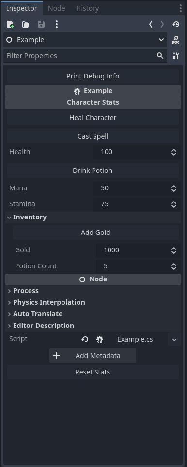

# ExportButton c# Addon for Godot Engine

## Description
The ExportButton attribute in Godot allows you to add buttons to the Godot Inspector for enhanced editor usability. 
These buttons can trigger specific methods directly from the editor.

## Table of Contents
1. [Installation](#installation)
2. [Usage](#usage)
3. [Example](#example)


---

## Installation

1. **Download the Plugin:**
   - Clone or download the repository to your local machine.

2. **Install the Plugin:**
   - Place the `ExportButton` folder in your project's `res://addons/` directory.

3. **Activate the Plugin:**
   - Open the **Project Settings** in the Godot editor.
   - Navigate to the **Plugins** tab.
   - Find `ExportButton` in the list and set the status to **Active**.

---

## Getting started

### 1. Add the `[Tool]` Attribute to the Script  
The script containing the methods with the `[ExportButton]` attribute must include the `[Tool]` attribute at the top. This ensures the script runs in the editor.  

```csharp
[Tool]
public partial class MyScript : Node
{
    // Script logic here
}
```

---

### 2. Annotate Methods with `[ExportButton]`
Use the `[ExportButton]` attribute to add buttons to the inspector. These buttons trigger the associated methods.

```csharp
[ExportButton("My Button")]
public void MyButtonAction() => GD.Print("Button clicked!");
```

### 3. Customize Button Placement
   Buttons can be positioned in specific locations in the inspector using the InspectorLocation enum:

 - Header: Top of the inspector.
 - Footer: Bottom of the inspector.
 - Category: Top of a specified category.
 - Group: Top of a specified group.
 - Property: Above a specific property.
Example: Adding a Button to a Category
```csharp
[ExportCategory("Character Stats")]
[Export] public int Health = 100;

[ExportButton("Heal Character", InspectorLocation.Category, "Character Stats")]
public void HealCharacter() => Health = 100;

//Or

[ExportButton("Heal Character")]
[InspectorLocationCategory("Character Stats")]
public void HealCharacter() => Health = 100;
```


## Example

```csharp
using Godot;

[Tool] // ExportButton must have the [Tool] attribute to work in the editor.
public partial class Example : Node
{
    [ExportCategory("Character Stats")]
    [Export] public int Health = 100;
    [Export] public int Mana = 50;
    [Export] public int Stamina = 75;

    [ExportGroup("Inventory")]
    [Export] public int Gold = 1000;
    [Export] public int PotionCount = 5;

    
    
    // Basic ExportButton usage, adds a button at the top of the inspector.
    [ExportButton("Print Debug Info")]
    private void OnPrintDebugInfoBtnPressed() => GD.Print($"Health: {Health}, Mana: {Mana}, Stamina: {Stamina}, Gold: {Gold}, Potions: {PotionCount}");
    
    
    
    // ExportButton with a specific location: this button appears in the "Character Stats" category.
    [ExportButton("Heal Character", InspectorLocation.Category, "Character Stats")]
    private void OnHealCharacterBtnPressed() => Health = Mana = Stamina = 100;
    
   

    // ExportButton placed under the "Character Stats" category using ExportButtonLocationCategory attribute.
    [ExportButton("Cast Spell")]
    [InspectorLocationCategory("Character Stats")]
    private void OnCastSpellBtnPressed()
    {
        if (Mana >= 10)
            GD.Print("Cast a spell! Mana left: ", Mana -= 10);
        else
            GD.Print("Not enough mana to cast a spell!");
    }
    
    
    // ExportButton linked to a specific property: this button appears above "Mana" in the inspector.
    [ExportButton("Drink Potion", InspectorLocation.Property, nameof(Mana))]
    private void OnDrinkPotionBtnPressed()
    {
        if (PotionCount-- > 0)
        {
            Health = Mathf.Min(Health + 20, 100);
            GD.Print("Drank a potion! Health: ", Health, ", Potions left: ", PotionCount);
        }
        else
            GD.Print("No potions left!");
    }
    
    
    // ExportButton appears under the "Inventory" group in the inspector.
    [ExportButton("Add Gold", InspectorLocation.Group, "Inventory")]
    private void OnAddGoldBtnPressed() => Gold += 50;
    


    
    // Appears at the very end of the inspector.
    [ExportButton("Reset Stats", InspectorLocation.Footer)]
    private void OnResetStatsBtnPressed()
    {
        Health = 100;
        Mana = 50;
        Stamina = 75;
        Gold = 1000;
        PotionCount = 5;
    }
    

    public override void _Ready()
    {
        if (Engine.IsEditorHint())
            return; // Exit early if running in the editor
    }
}
```
### Inspector Preview


